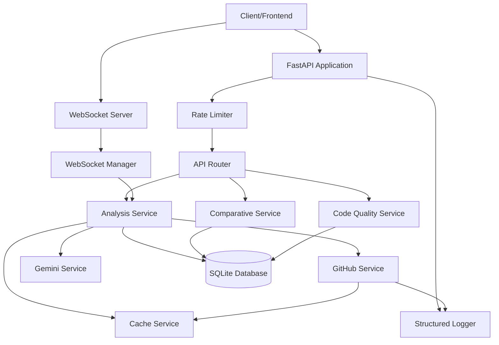

# System Architecture

## Overview

The GitHub Repository Analyzer is a production-ready FastAPI application that provides AI-powered repository analysis with real-time progress updates, caching, and comprehensive quality metrics.

## Architecture Diagram



## Core Components

### 1. **API Layer** (`main.py`, `routes/`)
- **FastAPI Application**: Main application with lifespan management
- **Rate Limiting**: SlowAPI-based rate limiting (10 requests/minute default)
- **CORS Middleware**: Configured for cross-origin requests
- **WebSocket Support**: Real-time progress updates

### 2. **Services Layer** (`services/`)

#### Analysis Service (`analysis_service.py`)
- Orchestrates the complete analysis workflow
- Manages background tasks for async processing
- Handles database transactions with proper rollback
- **Key Method**: `start_analysis()` - Creates session and queues background work
- **Key Method**: `execute_analysis()` - Performs actual GitHub + Gemini analysis

#### GitHub Service (`github_service.py`)
- Fetches repository metadata, README, files, and issues
- **Caching**: All API calls cached for 1 hour
- **Error Handling**: Comprehensive handling of rate limits, 404s, network errors
- **Branch Fallback**: Tries main/master branches automatically

#### Gemini Service (`gemini_service.py`)
- AI-powered repository analysis using Gemini 3
- **Mock Fallback**: Works without API key for testing
- Structured output using Pydantic models
- Single API call per repository

#### Cache Service (`cache_service.py`)
- In-memory caching with TTL support
- **Pattern**: `get_or_fetch()` for automatic cache-or-fetch
- Thread-safe with async locks
- Extensible to Redis for distributed caching

#### Code Quality Service (`code_quality_service.py`)
- Analyzes documentation, test coverage, organization, dependencies
- Provides 0-10 scores for each metric
- Identifies strengths and improvement areas

#### Comparative Service (`comparative_service.py`)
- Compares 2-5 repositories across multiple dimensions
- **Comparison Types**: Tech stack, architecture, complexity
- Finds common and unique technologies

### 3. **Database Layer** (`db/`, `models/`)

#### Schema (`models/schemas.py`)
**Split Table Architecture** for normalized storage:

- `repositories`: Core repo metadata
- `analysis_sessions`: Track analysis progress
- `analysis_summary`: Overview and confidence scores
- `tech_stack`: Individual technologies (many-to-one)
- `architecture_components`: Architectural components
- `key_files`: Important files identified
- `setup_steps`: Setup instructions
- `contribution_areas`: Safe areas for contributors
- `risky_areas`: Areas requiring caution
- `known_issues`: Issues from GitHub analysis
- `qa_logs`: Question-answer history
- `raw_analysis_responses`: Complete Gemini responses

#### Database Configuration (`db/database.py`)
- **Async SQLAlchemy**: Full async/await support
- **Foreign Keys**: Enabled via PRAGMA
- **Session Management**: Proper async session handling
- **Connection Pooling**: Configured for SQLite

### 4. **Utilities** (`utils/`)

#### Structured Logger (`logger.py`)
- JSON-formatted logs for production monitoring
- Contextual logging with metadata
- Integrates with log aggregation tools (ELK, Datadog)

#### Rate Limiter (`rate_limiter.py`)
- SlowAPI integration
- Configurable limits via environment variables
- Per-endpoint rate limiting support

#### File Filter (`file_filter.py`)
- Intelligent file prioritization
- Ignores build artifacts, dependencies
- Priority scoring: entry points (100), configs (80), source (60/40)

### 5. **WebSocket Layer** (`routes/websocket.py`)
- **Connection Manager**: Manages active WebSocket connections
- **Progress Updates**: Real-time analysis status
- **Keep-Alive**: Automatic ping/pong for connection health

## Data Flow

### Analysis Workflow

```
1. Client → POST /api/analyze-repo
2. API validates URL and creates Repository + AnalysisSession
3. Background task queued
4. API returns immediately with repo_id and status='processing'
5. Background task:
   a. Fetch GitHub data (with caching)
   b. Build context
   c. Single Gemini API call
   d. Parse and store results in split tables
   e. Update session status='completed'
6. Client polls GET /api/status/{repo_id} or uses WebSocket
7. Client fetches GET /api/analysis/{repo_id} when complete
```

### Question Answering Workflow

```
1. Client → POST /api/ask
2. API checks analysis status
3. Fetch all analysis data from database
4. Reconstruct Pydantic model from stored data
5. Gemini generates answer with context
6. Log Q&A in database
7. Return answer
```

### Comparative Analysis Workflow

```
1. Client → POST /api/compare
2. API fetches data for all repo_ids
3. Comparative service analyzes based on type
4. Returns common/unique elements and rankings
```

## Design Decisions

### Why Split Tables?
- **Normalization**: Avoid JSON blob anti-pattern
- **Queryability**: Easy to query specific tech stack items
- **Scalability**: Better indexing and performance
- **Flexibility**: Can add new analysis types without schema changes

### Why Caching?
- **GitHub Rate Limits**: 60/hour without token, 5000/hour with token
- **Performance**: Sub-second responses for cached data
- **Cost**: Reduce Gemini API calls

### Why Background Tasks?
- **User Experience**: Immediate response, no waiting
- **Reliability**: Analysis continues even if client disconnects
- **Scalability**: Can queue multiple analyses

### Why WebSockets?
- **Real-time Updates**: No polling overhead
- **Better UX**: Live progress indication
- **Efficiency**: Single persistent connection

## Security Considerations

### Current Implementation
- ✅ Rate limiting to prevent abuse
- ✅ Input validation via Pydantic
- ✅ SQL injection prevention (SQLAlchemy ORM)
- ✅ CORS configuration
- ✅ Environment variable secrets

### Production Recommendations
- 🔒 Add authentication (JWT tokens)
- 🔒 HTTPS only
- 🔒 Restrict CORS origins
- 🔒 Add request signing
- 🔒 Implement API keys
- 🔒 Add Sentry for error monitoring

## Performance Characteristics

### Typical Analysis Time
- **Without Cache**: 30-60 seconds
- **With Cache**: 5-10 seconds
- **Gemini Call**: 10-20 seconds

### Database Performance
- **SQLite**: Suitable for <10,000 repositories
- **Recommended**: PostgreSQL for production scale

### Memory Usage
- **Base**: ~50MB
- **Per Analysis**: ~5-10MB (cached data)
- **Recommendation**: 512MB minimum, 1GB recommended

## Scalability Path

### Current (Single Instance)
- Handles ~10 concurrent analyses
- In-memory cache
- SQLite database

### Phase 2 (Horizontal Scaling)
- Redis for distributed caching
- PostgreSQL for database
- Celery for background tasks
- Load balancer

### Phase 3 (Enterprise)
- Kubernetes deployment
- Separate analysis workers
- Message queue (RabbitMQ/Kafka)
- CDN for static assets

## Testing Strategy

### Unit Tests
- Service layer logic
- Utility functions
- Pydantic model validation

### Integration Tests
- API endpoints
- Database operations
- GitHub API mocking

### End-to-End Tests
- Full analysis workflow
- WebSocket connections
- Error scenarios

## Monitoring & Observability

### Logging
- Structured JSON logs
- Log levels: INFO, WARNING, ERROR
- Contextual metadata (repo_id, user_ip, etc.)

### Metrics (Recommended)
- Analysis completion rate
- Average analysis time
- Cache hit rate
- API response times
- Error rates by endpoint

### Alerts (Recommended)
- High error rate
- Slow response times
- GitHub rate limit approaching
- Database connection issues

## Deployment

### Local Development
```bash
python main.py
```

### Production (Docker)
```dockerfile
FROM python:3.11-slim
WORKDIR /app
COPY requirements.txt .
RUN pip install -r requirements.txt
COPY . .
CMD ["uvicorn", "main:app", "--host", "0.0.0.0", "--port", "8000"]
```

### Environment Variables
See `.env.example` for all configuration options.

## Future Enhancements

1. **PDF Export**: Generate shareable reports
2. **Trend Analysis**: Track repository evolution over time
3. **Multi-Repository Analysis**: Analyze entire organizations
4. **AI Code Review**: Automated security and performance suggestions
5. **Dependency Graph**: Visual dependency visualization
6. **Issue Timeline**: Interactive issue trend charts
